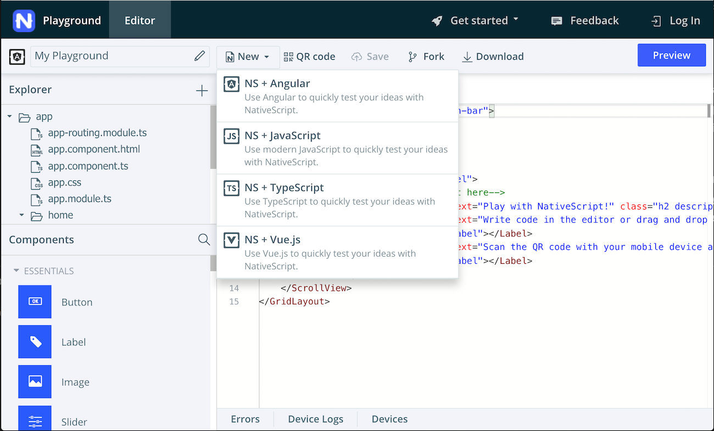
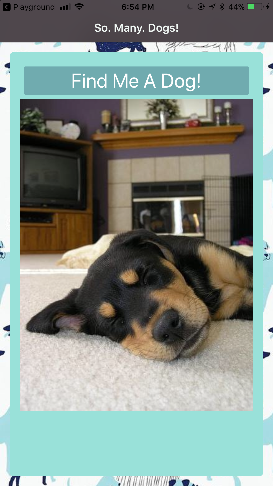
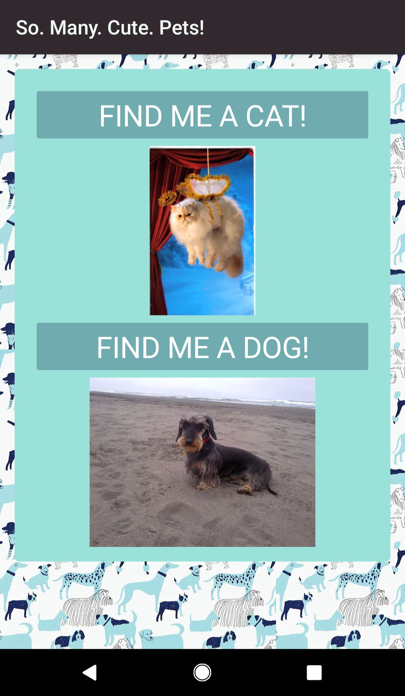

# 📱 Mini Workshop 2: ペットの情報を表示する Mobile アプリケーションの構築

| **プロジェクトのゴール** | ランダムにペットを表示するモバイルアプリを NativeScript-Vue で構築 |
| ----------------- | ------------------------------------------------------- |
| **このワークショップで学ぶこと** | NativeScript と Vue.js でのモバイルアプリの作り方、API コールとデータ表示の仕方 |
| **必要なツール** | モダンブラウザ（例：Chrome）<br><br>[NativeScript Playground](http://play.nativescript.org)（バージョン管理のためアカウント作成を推奨します）<br><br>iOS または Android のスマートフォンと NativeScript Playground、Preview アプリのインストール<br><br>Playground 用に NativeScript Viewer と NativeScript Playground の二つのアプリがセットで必要です。<br><br>Android: [NativeScript Playground](https://play.google.com/store/apps/details?id=org.nativescript.play) / [NativeScript Preview](https://play.google.com/store/apps/details?id=org.nativescript.preview).<br><br>iOS: [NativeScript Playground](https://itunes.apple.com/jp/app/nativescript-playground/id1263543946) / [NativeScript Preview](https://itunes.apple.com/jp/app/nativescript-preview/id1264484702) |
| **かかる時間** | 20分 |
| **サンプルアプリを試したい場合**   | [Playground App で開く](https://play.nativescript.org/?template=play-vue&id=c3o4tl&v=2) |

# インストラクション

## アプリケーション基盤の構築

[NativeScript Playground](http://play.nativescript.org) を開いてみましょう。初めて開いたときは主な機能の箇所を示すマークがいくつか表示されます。



メインエディタと数件のファイルがあります。デフォルトの Playground アプリは Angular で作成されています。上部の 'New' をクリックして 'NS + Vue.js' テンプレートを選んでください。これで NativeScript-Vue アプリの基盤構築ができます！

`QR Code` ボタンをクリックすると QR コードが表示されます。スマートフォンに入っている Playground アプリでスキャンしてください。あなたの端末がコードの変更に応じて自動的に更新されるようになります。端末が更新され、ベースとなるアプリが表示されるはずです：


## スタイルの追加

ではアプリのインターフェースにスタイルを施し、 UI を構築していきましょう。 ActionBar と Card、ボタンを使います。

`/images` フォルダを新規作成し、アプリの背景用の画像を追加します。上部のパネルの '+' ボタンをクリックして images という名称のフォルダを作ってください。下記の画像をローカルPCにダウンロードし、再度 '+' ボタンと 'upload resources' をクリックしてブラウズします。作成したフォルダに `bg.jpg` としてこのファイルを追加してください。ファイルの保存のお忘れなく！


次に、ルートにある app.css ファイルを開きます。このようにファイルを上書きしてください：

```css
Page {
	background-image: url('~/images/bg.jpg');
}

.action-bar {
	background-color: #32292f;
	color: #f0f7f4;
	font-size: 20px;
}
.btn {
	background-color: #70abaf;
	color: white;
	padding: 10px;
	margin: 20px;
	font-size: 30px;
	border-radius: 5px;
}
.card {
	vertical-align: top;
	margin: 15;
	padding: 15;
	border-radius: 5;
	background-color: #99e1d9;
}

.placeholder {
	height: 100%;
}
```

アプリが更新されると UI が変更されたことがわかりますが、少し不自然です。 UI を修正していきましょう。

## UI の修正

ActionBar を修正します。 `app/components/HelloWorld.vue` を開き、ActionBar 以外の `<Page>` タグの間の内容を全て削除してください。そして ActionBar にタイトルを追加します。例： `<ActionBar title="So. Many. Dogs!" class="action-bar" />`

次に、今ある ScrollView の代わりに StackLayout を追加します。ActionBar の下、 `</Page>` の閉じタグの上の場所に、このようにボタン付きのレイアウトを追加してください：

```xml
    <StackLayout class="card">
        <Button class="btn" @tap="getADog">Find Me A Dog!</Button>
    </StackLayout>
```

これで、いい感じの緑色のカードと濃い緑色のボタンが見えるはずです。

::: tip 💡
NativeScript のレイアウトは Web で使う HTML とは異なります。ここで利用しているのは NativeScript XML マークアップで、ネイティブUIの GridLayouts や StackLayouts に変換されるものです。
:::

## データの追加

ここからは UI にデータを投入していきます。外部と HTTP 通信をするために HTTP モジュールを活用する必要があります。 HelloWorld.vue の `<script>` タグの直下の行（`export default` の上）にこちらを追加してください：

`const http = require("http");`

そして `data` ブロックを編集します。犬の画像の初期値を設定しておきます。後ほどすぐに Dog CEO API のデータがここに投入される予定です。

```js
data() {
    return {
      dogImage: {}
    }
  },
```

最後に、画像を投入するためのスペースを作成します。Button タグの下、最後の `</StackLayout>` 閉じタグの上にこれを追加してください：

```xml
 <StackLayout class="placeholder">
      <Image :src="dogImage.message" />
 </StackLayout>
```

::: tip 💡
端末でアプリの自動更新が止まってしまったら、"Preview" ボタンを推して QR コードの再スキャンを試してみてください。Playground のコンソールにエラーが出ていないか確認してください。
:::

## 通信する

最後にやることは、Dog CEO API を呼ぶメソッドを追加し、ボタンを押したらカードにデータが投入できるようにすることです。ランダムなデータを取得するよう API に問い合わせます。

`methods` セクションを `data` ブロックの最後のカンマの下に追加してください：

```js
methods: {
    getADog() {
      http.request({ url: "https://dog.ceo/api/breeds/image/random", method: "GET" }).then((response) => {
        this.dogImage = JSON.parse(response.content);
        console.log(this.dogImage.message);
      }, (e) => {
        alert("error")
      });
    }

  }
```

ボタンを押して犬が表示されるか見てみてください。可愛いでしょ？もし何か不具合があったら、コンソールに犬の画像のURLのログが出ているか確認してみてください。

HelloWorld.vue の全体のコードはこのようになっているはずです：

```js
<template>
	<Page class="page">
		<ActionBar title="So. Many. Dogs!" class="action-bar" />
		<StackLayout class="card">
			<Button class="btn" @tap="getADog">Find Me A Dog!</Button>
			<StackLayout class="placeholder">
				<Image :src="dogImage.message" />
			</StackLayout>
		</StackLayout>
	</Page>
</template>

<script>

const http = require("http");

  export default {

  data() {
    return {
      dogImage: {}
    }
  },
  methods: {
    getADog() {
      http.request({ url: "https://dog.ceo/api/breeds/image/random", method: "GET" }).then((response) => {
        this.dogImage = JSON.parse(response.content)
        console.log(this.dogImage.message)
      }, (e) => {
        alert("error")
      });
    }
  }
}

</script>
```

最終的なアプリはこんな感じです：



NativeScript Playground で Vue.js の モバイルアプリを作るのはとても楽しいですね。これでやり方がわかったので、次は何を作りましょう？

**🎊ベースプロジェクト修了です。おめでとうございます！🎊**

## Supplement 1: Adding a Cat to the App

Suppose you want to also be able to load cute cat photos with your dog photos. This will require another API request. The cat API requires a key which you can request at [the CatAPI](https://thecatapi.com/). They will email your new api key to you. Make a note of it when you receive the key via email.

## Edit the UI

Update the ActionBar to indicate we have more than dogs on the app.

`<ActionBar title="So. Many. Cute. Pets!" class="action-bar" />`

Update the placeholder size in the `app.css` file so that we can fit more than one placeholder on the page:

```js
    .placeholder {
        height: 30%;
    }
```

## Call Some Cats

Next, add a method called `getACat`. It will look like the `getADog` method. But the Cat API requires an api key, so after we pass the url and the method, we will pass a limit of 1 and a header with the key. After making the request, the `getACat` method will update a variable called `catImage` and log the `catImage.url` that is returned by the request.

Add this method above the `getADog` method, adding your own API key for the Cat API:

```js
        methods: {
            getACat() {
                http.request({
                    url: "https://api.thecatapi.com/v1/images/search",
                    method: "GET",
                    limit: 1,
                    header: {
                        key: "xxxxxxxx-xxxx-xxxx-xxxx-xxxxxxxxxxxx"
                    }
                }).then(
                    response => {
                        this.catImage = JSON.parse(response.content)[0];
                        console.log(this.catImage.url);
                    },
                    e => {
                        alert("error");
                    }
                );
            },
            getADog() {
            ...
            }
        }
```

Now you need to update the image that will be added to the placeholder.

In the `data()` part of the script, we returned the `dogImage`, and now we need to return the `catImage`. Add `catImage` above `dogImage` in the data block:

```js
    data() {
        return {
                catImage: {},
                dogImage: {}
            };
        },
```

::: tip 💡
Don't forget the comma that we use to separate the two methods (`getADog` and `getACat`) and the two return variables (`dogImage` and `catImage`).
:::

## Edit the UI

Finally, we need to add a button to load the cat within a `StackLayout` placeholder. Place this in between `<StackLayout class="card">` and `</StackLayout>` at the same level as the button and placeholder for the `dogImage`:

```xml
    <Button class="btn" @tap="getACat">Find Me A Cat!</Button>
    <StackLayout class="placeholder">
        <Image :src="catImage.url" />
    </StackLayout>
```

Click the `Preview` button in the NativeScript Playground and you will see the new `Find Me A Cat!` button and when you click it, you should see a very cute cat!

It should look like this:



::: tip 💡
If you are having any trouble loading the images from the cat api, you can get more information in the `Device Logs` at the bottom of the Playground screen. To do this, you need to set `Config.silent = false` in `app.js`. By default, in `app.js` you should see the lines below commented out. Uncomment the second line to get more verbose output.

    // Uncommment the following to see NativeScript-Vue output logs
    Vue.config.silent = false;

:::

## 著者

Made with ❤️ by Jen Looper and Emily Stamey
