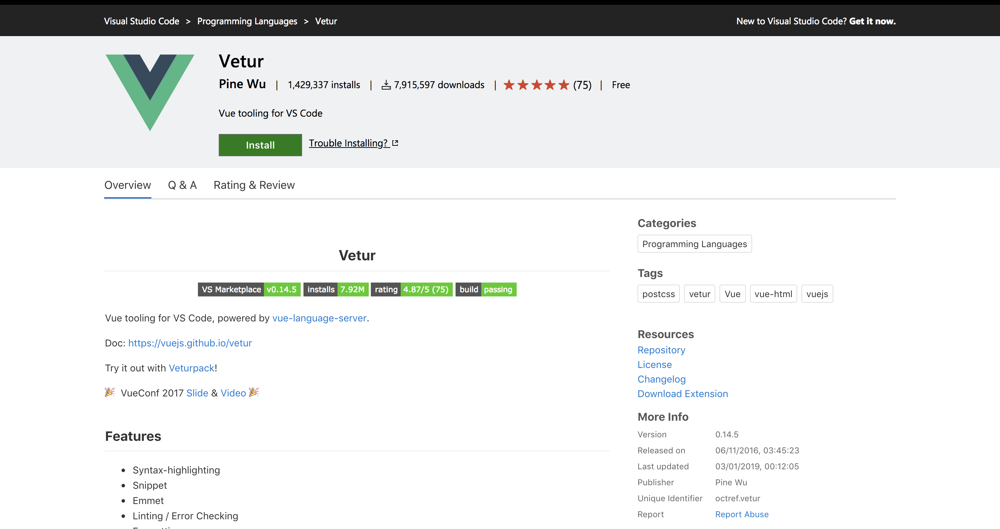
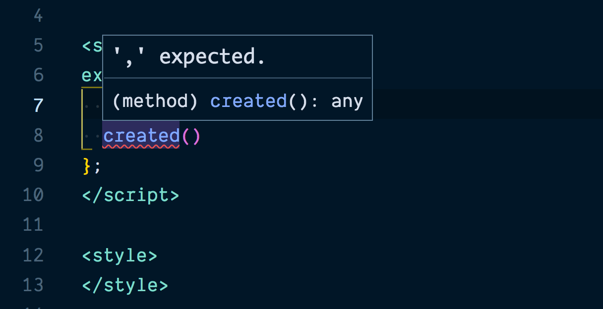

# 🛠 Nano Activity 3: Setup VS Code the Right Way for Vue (beginner)

| **Project Goal**            |  The goal of this nano is to learn how to properly setup VS Code for Vue development                                                                                                                                   |
| --------------------------- | ------------------------------------------------------------------------------------------------------------------------------------------------------------------------------------------------ |
| **What you’ll learn**       | You'll learn how to setup VS Code for development with Vue.                                                                                            |
| **Tools you’ll need**       | A modern browser like Chrome or Firefox, Access to [Visual Studio Code Editor](https://code.visualstudio.com/download)
| **Time needed to complete** | 15 minutes


# We're going to learn how to setup VScode the right way for Vue

In this activity we are going to walkthrough how to configure your [VS Code](https://code.visualstudio.com/) workspace for appropiate development with Vue. As a developer working with Vue, it is a great deal to setup your work tool to increase productivity whereby you use a tool that already do most of the work you neccessarily don't need to bother about.

## Get Started

In order to start developing Vue applications. A required step is to first setup your workspace or code editor for development and this nano is going to highlight how to setup VS Code for Vue.

## Install Vetur
We'll be required to install [Vetur](https://marketplace.visualstudio.com/items?itemName=octref.vetur) extension from Visual studio marketplace. This plugin powers a number of features that makes developing with Vue easy. Some of these features include the following:

- Syntax Highlighting
- Snippets
- Emmets
- Linting / Error checking
- Formatting
- IntelliSense

We can install it directly from the marketplace by clicking on the install button.



::: tip 💡
Another way to install this extension is directly from VS Code by clicking on the extension tab and searching for Vetur and directly install in on VS Code.
:::


## Syntax Highlighting

Vetur supports syntax highlighting for the following languages


## Snippets
Vetur provides VS Code the ability to use snippets within the Components.

`scaffold`
```html
<template>
...
</template>

<script>
export default {
...
}
</script>

<style>
...
</style>
```

`template with HTML`

```html
<template>
...
</template>
```

`style with SCSS`
```html
<style lang="scss">
...
</style>
```

## Emmets
Vetur supports emmets for the following languages: html, css, scss, less, stylus without the need for configuration.


## Linting / Error checking

Vetur provides error-checking and linting and can be configured to make use of eslint plugin.



## Formatting
Vetur has support for formatting of the following languages html, css, scss, less,postcss, stylus, js, ts. with the help of formatter like Prettier.

Automatic formatting can either be done on save command or there's an option to format entire document.


## IntelliSense
Vetur offers IntelliSense all over your .vue file by default.


## Conclusion
This is a great way of configuring your work environment for development with Vue, with all these tool setup on VS Code you can stay assured your workflow will be clean and easy.

## Badge

Congratulations! You have earned a badge!


## Author

Made with ❤️ by Gift Egwuenu
